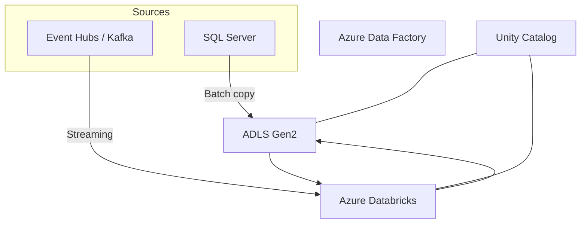

## Target architecture

- Ingestion (batch): Azure Data Factory (Terraform-managed) from SQL Server to ADLS bronze
- Ingestion (streaming): Databricks Structured Streaming from Event Hubs/Kafka to bronze
- Processing: Databricks (DLT + Jobs) for bronze → silver → gold
- Governance: Unity Catalog catalogs per product, external locations on ADLS, Purview (optional)
- Security: Key Vault, managed identities, private endpoints, VNet injection
- Observability: Azure Monitor/Log Analytics, DLT metrics

### Medallion layout
- ADLS: `/bronze|silver|gold/<product>/<entity>`
- UC: one catalog per data product; schemas `bronze`, `silver`, `gold`

### Provisioning and deployment
- Terraform manages infrastructure and ADF
- Databricks Asset Bundles manage jobs/pipelines and configurations

### Diagram (conceptual)
